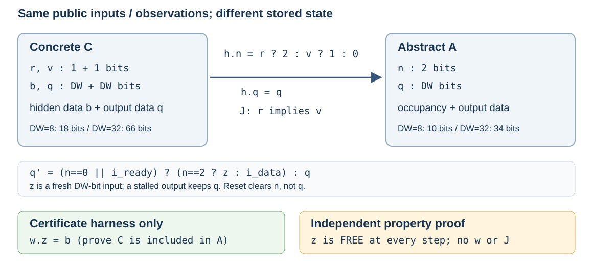
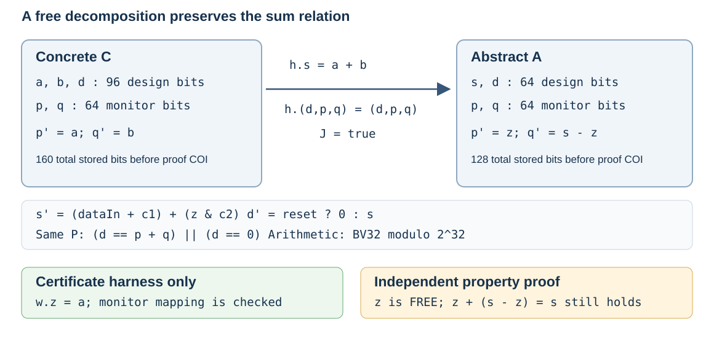

# AIsimpV：中小型 RTL 狀態改寫的可驗證性

報告日：2026-09-23。人工矩陣 `wednesday-20260921-final01` 已凍結；固定 C/A pilot 為 INFRASTRUCTURE_BLOCKED；joint pilot 在兩次內取得 ACCEPTED＋SAFE 候選。

**人工矩陣的四個指定 rewrite 均通過包含檢查且保留目標 property；四個過粗抽象產生假反例，四份錯證書被拒絕。LLM joint pilot 另自動產生一個 18→10 bits 的安全候選；固定 C/A pilot 則因工具錯誤受阻。**本輪要驗證的是：改變 RTL 內部狀態表示後，能否以 `h / J / w` 證書，讓獨立 checker 確認指定觀察行為包含原設計，再由不讀取證書的 property backend 證明凍結的 safety property。

人工指定的改寫可驗證、LLM 能找到改寫、抽象能加快驗證，是三個分開的問題。這份報告分列人工矩陣與自主生成紀錄；沒有重複量測與完整成本證據就不宣稱加速。

## 1. 本輪範圍與結論位置

主集合固定為 **4 個 design/config/property tasks：1 個人工控制案例、2 個公開設計家族的 3 個實例**。每題有 good、coarse、bad-certificate 三筆基本 attempt，共 12 筆；good/coarse 是 8 個不同 C/A pairs，bad certificate 重用同一 good A。另有乾淨 source 重跑的 12 筆驗證 attempts，不增加 task 分母。FSM 反向 certificate 與 strictness/cover/replay 另記。

| Task | 類型與 property | 改寫 | 正式結果 |
| --- | --- | --- | --- |
| R1-fsm | 人工 3-state FSM；idle/busy/done 恰一成立 | one-hot → binary | ACCEPTED / SAFE |
| R2-skid8 | ZipCPU skidbuffer，DW=8；stall 保持 valid/data | 隱藏 buffer data → 自由資料；valids → occupancy | ACCEPTED / SAFE |
| R3-skid32 | 同一公開家族，DW=32；同一 property | 同一改寫，增加資料位寬 | ACCEPTED / SAFE |
| R4-pipe32 | AVR pipeline；保留原 history-sum property | 兩個 pipeline state → sum＋自由分解 | ACCEPTED / SAFE |

P1 counter/P5 stalled producer 是既有回歸，不增加這四題的分母。FIFO 不屬本輪核心集合。各 task 的確切來源、參數、hash 與 reset 定義見 [source manifest](../../fixtures/public/sources.json) 與 [semantics v1](../semantics_v1.md)。

## 2. 語意與獨立檢查邊界

所有案例採單一正緣 clock、更新前觀察、bit-vector 算術；有 reset 的案例把同步 reset 視為每拍自由的公共輸入，沒有額外 initial-reset 或環境假設。未宣告的初值不能補成零。初版不涵蓋多 clock、改 latency、liveness 或 symbolic memory。

`h` 將 C 的狀態映成 A 的狀態；`J` 必須從初值成立並經每一步保持；`w` 只在 certificate harness 選取 A 的 nondeterministic input，證明每個合法 C 步驟都存在相符的 A 步驟。checker 驗證初始集合非空及 INIT_J、STEP_J、INIT_MAP、STEP_MAP、OBS_MAP；未知或 timeout 不接受。

property backend 的輸入只有 A 與凍結 contract，沒有 h/J/w。新增自由值每拍任意；因此 `A ⊨ P` 搭配通過的包含關係才可支持 C 的 P。抽象反例仍須在 C 固定相同公共 inputs/observations 做 exact replay，certificate failure 不等於 design bug。

## 3. Skidbuffer：刪除資料狀態，保留 stall 關係



圖根據本輪實際 RTL：上游 [skidbuffer.v](../../fixtures/public/upstream/skidbuffer.v) 與 [skid_abstract.v](../../fixtures/public/skidbuffer/skid_abstract.v)。圖中的位數是 design state，不含 property harness 的取樣暫存器；正式後端的 COI/前處理規模另外報告。

C 保留兩個 valid bits `r/v`、內部資料 `b` 與輸出資料 `q`。A 以 2-bit occupancy `n` 取代 valid 表示，刪除 b，只保留 q。h 以 `r ? 2 : v ? 1 : 0` 計算 n，J 是 `r ⇒ v`，certificate witness 選 `z=b`。

抽象 proof 中 z 任意，但 stalled output 的 q 仍 hold。固定 property 是 `o_valid && !i_ready && !i_reset ⇒ next(o_valid) && next(o_data)==o_data`。這是上游 RTL 的**衍生 port-level task**，未載入完整 upstream FORMAL harness，不能宣稱上游全部 properties 通過。

coarse A 讓 q 每拍自由取 z，故不再保留 hold 關係；它仍有正確 witness `z=C.q_next` 可證包含。bad-certificate control 則保持 good A，把 witness 改為零，測試 STEP_MAP 能否擋住錯誤對應。

## 4. Pipeline：保留同一自由分解中的加法關係



圖根據上游 [pipeline.v](../../fixtures/public/upstream/pipeline.v) 與 [pipeline_good.v](../../fixtures/public/pipeline/pipeline_good.v)。原設計以 a/b/d 三個 BV32 儲存計算狀態；原 assertion 所用 p/q 另占 64 monitor bits。A 把 a/b 改成 s，保留 d/p/q。所有加減法取模 `2^32`。

`h.s=a+b`、其餘 state identity、J=true、w.z=a。A 用 `z` 與 `s-z` 更新兩個 history monitor，故自由選擇不會丟掉相加等於 s 的關係。原 property `d==p+q || d==0` 保留；reset 只清除 d，沒有擅自清除 stages 或 monitors。

coarse A 把第二個 view 改成獨立 z2。w=(a,b) 仍能匹配 C，但 `z+z2=s` 不再保證。bad certificate 保持 good A，只把 h.s 改成 a；這與抽象過粗是兩種不同失敗。

## 5. 人工矩陣：結果、規模與完整成本

本節只使用凍結的 `wednesday-20260921-final01`。實際方法為 **Yosys SMTBMC＋Z3，base check＋k-induction**，C/A 同用 requested depth 20 與每次 property proof 120 秒上限；不是把 depth 20 的 BMC 無反例直接標 SAFE，也不是宣稱執行過 SBY prove。四個 B0 都為 SAFE。

<!-- MANUAL_RESULTS_START -->
| Task | Good：gate / P | Coarse：gate / P / replay | 同一 good A＋錯證書 | 反向／strictness |
| --- | --- | --- | --- | --- |
| R1-fsm | ACCEPTED / SAFE | ACCEPTED / CEX / SPURIOUS_TRACE | REJECTED：STEP_J | 反向 ACCEPTED，指定觀察等價 |
| R2-skid8 | ACCEPTED / SAFE | ACCEPTED / CEX / SPURIOUS_TRACE | REJECTED：STEP_MAP | 嚴格抽象 trace 已查驗 |
| R3-skid32 | ACCEPTED / SAFE | ACCEPTED / CEX / SPURIOUS_TRACE | REJECTED：STEP_MAP | 嚴格抽象 trace 已查驗 |
| R4-pipe32 | ACCEPTED / SAFE | ACCEPTED / CEX / SPURIOUS_TRACE | REJECTED：STEP_MAP | 嚴格抽象 trace 已查驗 |

四個 good 改寫均包含 C 且保留 P；其中兩個公開家族的三個實例全部通過。四個 coarse 改寫仍有正確 certificate，但 property backend 各找到 CEX；另外保存的人工 trace 也通過 A-prefix SAT、P 違反與 C exact replay INFEASIBLE，故分類為 SPURIOUS_TRACE。四份錯證書全部被拒絕；bad-certificate 列不再執行 property proof，並非 property failure。

FSM 正反向 certificate 皆通過；skid8/skid32/pipeline 的 good A 各有一條不違反 P、但在 C 無法重播的可行觀察 trace，支持指定觀察下的嚴格 over-approximation。四題 good/coarse 的 concrete cover traces 都為 FEASIBLE。完整 12 列見 [manual-results.csv](data/manual-results.csv)，原始精度與額外 checks 見 [manual-summary.json](data/manual-summary.json)。
<!-- MANUAL_RESULTS_END -->

原始 RTL design bits、原 property monitor bits、新增 nondet bits，與 formal backend 正常 COI/前處理後的 state bits/cells 分開列。共用 property harness 引入 `past_valid` 與取樣用 observation/input registers，再由前處理移除不需要的 captures；因此表中的後端規模包含 DUT、原 monitor 與仍存活的 harness state。skid 會記住 hold antecedent 與資料；FSM/pipeline 的 current-state predicate 也經同一取樣 harness，不能把額外 captures 算成原 RTL monitor 或直接忽略。

<!-- COST_RESULTS_START -->
| Task | Design bits C→A | 原 monitor bits C→A | A nondet bits good/coarse | COI 後 state bits C→A | COI 後 cells C→A |
| --- | --- | --- | --- | --- | --- |
| R1-fsm | 3→2 | 0→0 | 0/2 | 7→6 | 25→25 |
| R2-skid8 | 18→10 | 0→0 | 8/8 | 30→22 | 35→33 |
| R3-skid32 | 66→34 | 0→0 | 32/32 | 102→70 | 35→33 |
| R4-pipe32 | 96→64 | 64→64 | 32/64 | 257→225 | 20→20 |

正常前處理後仍存活的 property-harness state 分別為 4、12、36、97 bits；它們已包含於上表 COI 後的總數。pipeline 的原 monitor 64 bits 仍另列，不混成 harness。cells 是 Yosys 中間表示的 cells（含 assert/scopeinfo），不是映射後的 gate count。

以下為單次執行的秒數，取三位小數；非三次重跑中位數。

| Task | B0 | Good 前端 | Good 證書 | Good property | Good replay/cover/strictness | Good 反向證書 | Good workflow | 三筆 workflow 合計 |
| --- | ---: | ---: | ---: | ---: | ---: | ---: | ---: | ---: |
| R1-fsm | 0.545 | 0.517 | 0.137 | 0.529 | 0.064 | 0.180 | 1.433 | 3.613 |
| R2-skid8 | 0.559 | 0.550 | 0.193 | 0.564 | 0.163 | 0.000 | 1.477 | 3.670 |
| R3-skid32 | 0.543 | 0.547 | 0.180 | 0.619 | 0.168 | 0.000 | 1.520 | 3.707 |
| R4-pipe32 | 0.604 | 0.562 | 0.204 | 1.014 | 0.140 | 0.000 | 1.923 | 4.184 |

全部人工候選 workflow **15.175 秒**，四個 B0 合計 **2.251 秒**，suite wall time **17.439 秒**。正向 certificate stages 合計 2.238 秒；FSM 反向另 0.180 秒。workflow 另含協調與資料處理耗時，因此不只等於四個 solver 欄位相加。這次單次 pilot 的 good workflow 都高於各自 B0；結果支持可驗證性，沒有提供端到端加速證據。

另以 `git archive 6901b49` 解出的乾淨 source 重跑 12 筆：分類與 C/A/contract/certificate hashes 逐列一致（[reproduction record](data/manual-reproduction.json)）。這次額外驗證耗時 suite **18.584 秒**，其中 candidate workflow 16.160 秒、B0 2.406 秒；兩次 suite 共 **36.023 秒**。它不是三次 timing median，沒有被選來替換較慢的量測；完整重跑 summary/log 在 raw evidence ZIP。
<!-- COST_RESULTS_END -->

`T_workflow = Σ生成 + Σ前端 + Σ證書 + Σabstract property + Σreplay/strictness/refinement`。所有嘗試和失敗計入；FSM 反向證書單列但納入成本。B0 使用同一 engine、depth 與正常 preprocessing，每個固定 C/contract 僅執行一次，不能因它出現在三個 variant 列中重複相加。suite wall time 另列。以上成本的範圍是這次凍結的正式 run；開發 qualification 與工程回歸不是這 12 筆正式 attempts，也沒有納入本表，不能把本表當作整個研究的投入。人工發現／準備時間未量測，不能把 machine time 當作完整人力成本。

## 6. 兩個獨立 LLM pilots

兩個 pilots 各最多 4 個候選、900 秒 generation＋verification 預算，與人工 12 筆基本 attempts 分開。pilot A 固定 C/A，只尋找 certificate；pilot B 只提供 C/contract，產生 A 後重新匯出 manifest 並產生 certificate。它們各是一條回饋修正鏈，不是無回饋／有回饋的對照 ablation。

生成端只讀取經審核的 input bundle，其中包含 contract 的唯讀副本，並僅能在限定候選目錄寫入。父端的可信 contract 原件、checker 與檢查紀錄不可由生成端修改；gold certificate、計畫公式、無關對話與 Git metadata 不提供給生成端。固定 C/A 檔案工作區先做 OS probe 與 trusted hash checks；qualification probe 通過不代表真正 Codex 工具啟動路徑也成功。完整 protocol 見 [llm_protocol.md](../llm_protocol.md)。

<!-- LLM_RESULTS_START -->
| Pilot | 實際候選數 | 結果與 feedback 鏈 | 計費生成／驗證成本 | 人工介入 |
| --- | --- | --- | --- | --- |
| 固定 C/A certificate | 4 infrastructure attempts；0 可驗證候選 | INFRASTRUCTURE_BLOCKED；工具啟動錯誤 | 309.551＋0.189＝309.740 秒；wall 408.163 秒 | 工具診斷／中止／隔離修復；沒有提供 mapping |
| Joint RTL＋certificate | 2 attempts；同一份生成 RTL、2 份 certificate | a1 stale hash ERROR → a2 ACCEPTED＋SAFE | 84.500＋2.284＝86.784 秒；wall 87.061 秒 | 開始前修訂 transport；父端未修候選內容 |

兩個 pilots 已計費合計 **396.524 秒**，包括所有失敗與第二次的診斷停頓上界。各有自己的 attempt cap，未將固定 pair 的失敗轉移到 joint 的新額度。兩個 pilot 的任務與 transport 均不同，不能合成一個「成功率」。

| Pilot / attempt | 分類 | 計費生成秒 | 驗證秒 | 實際 feedback / verdict |
| --- | --- | ---: | ---: | --- |
| certificate / 1 | infra failure | 120.748 | 0.077 | 空 JSON → ERROR；未到達 proof obligations |
| certificate / 2 | infra interrupted | 114.014 | 0.000 | 父端中止；無可驗證候選 |
| certificate / 3 | infra failure | 28.788 | 0.057 | 空 JSON → ERROR；未到達 proof obligations |
| certificate / 4 | infra failure | 46.000 | 0.055 | 空 JSON → ERROR；未到達 proof obligations |
| joint / 1 | binding ERROR | 67.905 | 0.980 | 實際 manifest/hash 回饋：stale abstract hash |
| joint / 2 | SUCCESS | 16.596 | 1.304 | gate ACCEPTED；自由 z 的 P 為 SAFE |

Joint 的實際 rewrite 保留 `r_valid/o_valid` 兩個 valid bits，刪除 8-bit `r_data`，以自由 z 替代其資料讀取：C 的 18 design bits → A 的 10 bits。它沒有採用人工 gold 的 occupancy 重編碼。生成證書以保留 state 的 identity projection 作 h、J=true、w.z=C.r_data；這份關係與 RTL 均出自模型候選，不是父端填入。正常 proof preprocessing 後為 22 state bits（含 12 harness bits）、34 cells。

第一次因證書的 abstract hash 不符，checker 在綁定檢查回 ERROR，尚未檢查證明義務。模型收到真正匯出的 manifest/hash 後修正 certificate，第二次 gate ACCEPTED 且自由 z 下 P 為 SAFE。兩次 `abstract.v` 位元組完全相同，來源 SHA-256 為 `ea7321e2ba0d3fc46849be5bce8267ddbdff07a3020b70f4d2ebb879a00e8560`。這展示了 hash feedback 後的修正紀錄，沒有證明 feedback 相對無回饋的因果收益。

生成 RTL 的內容與人工 gold 不同，不能直接沿用人工 strictness trace 的結果；本 pilot 的 strictness 尚未另證。主流程以原始候選位元組、frozen snapshot-v3 及新輸出目錄[獨立重驗](data/llm-reproduction.json)：a1 仍是 stale-hash ERROR，a2 仍是 10 bits／ACCEPTED／SAFE。額外兩筆 verification 合計 1.547 秒，沒有新增模型呼叫或改候選，不能當成第三次生成 attempt。另一次先前重驗因相對輸出路徑的操作錯誤，無法進入 gate；該 export phase 耗時 0.724 秒並保留 log，未量測完整協調 wall time。這是重驗操作錯誤，不改寫 LLM 的兩筆結果。
<!-- LLM_RESULTS_END -->

固定 C/A pilot 的輸出並未到達證書語意檢查：attempt 1/3/4 留下空 certificate，格式檢查為 ERROR；attempt 2 因反覆 sandbox 啟動失敗由父端中止，保留 INTERRUPTED_INFRASTRUCTURE。已查證的工具錯誤為 `bwrap` 的 loopback `RTM_NEWADDR EPERM`。第二次的 114.014 秒是含協調診斷停頓的保守上界，未宣稱純模型推論時間。四次都計入原 attempt cap，沒有重開 pilot 洗去失敗。

Joint 在開始前採用獨立 `snapshot-v3` 修訂 transport：將同一經審核 input bundle 與 canonical hash metadata 全文 inline 提供給無工具的 Codex，輸出結構化候選，由父端逐字存檔後重新匯出／檢查。此修訂縮窄生成端能力，保留原 contract、獨立 verification 與 4 次／900 秒預算；沒有提供 h/J/w 公式。這是已記錄的 infrastructure intervention／protocol amendment，不能將兩個 pilots 當作只差「是否固定 A」的控制實驗。

既有配置為 `gpt-5.6-sol`、reasoning effort `high`、Codex CLI `0.154.0`；這是 CLI 宣告的 model/config，不推測 provider 內部路由。固定 C/A 的第 1/3/4 次有 token usage，第 2 次 unavailable，因此不報該 pilot 的完整 token 總數。Joint 的兩次 usage 均可取得，合計 input tokens 34,968、output tokens 3,750（另記 reasoning output tokens 2,679，不與 output 欄相加）；兩個 pilots 的 `cost_usd` 均 unavailable。

基礎設施／工具啟動失敗與 model/certificate failure 分開分類；前者仍保留原 attempt 與已消耗時間，不能改成模型找不到對應，也不能在修復後重設搜尋預算。同一 task 的單次 pilot 不能支持一般成功率或 feedback 有效性推論。保存所有原始候選、實際 verdict、model/config、可取得的 usage；缺少 token 或金額時記 unavailable，不能推算或編造。若需要人工提供 h/J/w 修正，標 assisted，不能列為自主發現。

兩個 pilots 的實際欄位與原始 ledger SHA-256 見 [llm-summary.json](data/llm-summary.json)。此小表也收錄 reviewed protocol-amendment sidecar：joint 原 ledger 的 `human_intervention=[]` 不代表整個實驗沒有基礎設施介入；candidate formula assistance 為 false 與 protocol 修改是兩個欄位。

## 7. 如何解讀負例

skid8 的一條人工構造 trace：初始 valid=0/data=0；第一拍接受 `0x12` 後 valid=1/data=`0x12`；下一拍 `ready=0, reset=0` 時，coarse A 的 data 卻變成 `0x34`。A-prefix 為 SAT 且違反 hold，C exact replay 為 INFEASIBLE。這是過粗抽象的假反例，不是原 RTL bug。另一個控制則維持 good A，只把 witness 改為 0，checker 在 STEP_MAP 取得 SAT 反證並拒絕它。兩個失敗被不同關卡辨認。

| 觀察到的結果 | 可支持的結論 | 不能直接推出 |
| --- | --- | --- |
| certificate 被拒絕 | 該 C/A/certificate 組合未證成包含 | 原始設計有 bug；所有其他 certificate 都不可能 |
| gate 通過，A 有 violating trace，C replay 不可行 | 抽象包含 C，但丟失該 property 所需關係 | C 有 bug |
| gate 通過，A SAFE | 在凍結語意與觀察範圍內，C 的目標 P 有保證 | 完整功能等價；驗證更快；支援任意 RTL |
| A trace 可行，C 同 inputs/observations 不可行 | 該觀察語意下是嚴格 over-approximation | 所有安全 property 都仍可證 |
| 未有 proof／replay 終態 | UNKNOWN/ERROR/NOT_RUN 等原狀態 | SAFE 或 BUG |

每條 trace 都須從合法初值可達。本輪若使用人工構造 trace，明列其來源，再用獨立 SMT 查驗 A-prefix、P 違反與 C exact replay；不冒充 solver 自動抽出的反例。

## 8. 報告結論與後續決策

<!-- CONCLUSION_START -->
本輪在 **4/4 個預先指定 tasks** 上驗證了指定人工 rewrite 的包含關係與目標 P，其中公開部分為 **2 個家族、3/3 個實例**。FSM 有雙向證據；兩種公開 rewrite 有嚴格抽象 trace。這證成的是本組合約下的非局部改寫可驗證性，以及 checker/property/replay 能分開辨認錯證書與關係丟失。

全部基本 12 attempts 均得到預期分類，沒有移除失敗列。單次 good workflow 皆高於正常 B0，不能把 state reduction 寫成驗證加速。固定 C/A pilot 的四次工具基礎設施失敗耗盡 attempt cap，0 個可驗證 certificate；其結果是 INFRASTRUCTURE_BLOCKED，無法判斷 LLM 的對應發現能力。Joint pilot 在修訂的 inline transport 下，兩次內取得一個由模型提出的資料狀態刪除候選，gate 與 P 均通過；沒有自動發現 occupancy 重編碼的證據。這支持一次具體候選的自主生成與可驗證性，不能推廣為任意 RTL rewrite 成功率。人工 gold 成果仍與 LLM 結果分開。
<!-- CONCLUSION_END -->

若 gold 可證但 LLM 找不到關係，下一步應分析 mapping discovery 與 certificate 格式；若 gate 可過但 P 失敗，下一步是找回 property 所需關係。只有完整時間資料顯示重複求證的成本，才投入 summary reuse 或分解；多 clock、latency 改變、symbolic memory 仍在本輪範圍外。

### 證據與重跑索引

<!-- EVIDENCE_START -->
- [凍結人工 summary](data/manual-summary.json) 與 [12 筆 CSV](data/manual-results.csv)；run ID：`wednesday-20260921-final01`。
- [LLM summary](data/llm-summary.json) 與 [saved-candidate 重驗](data/llm-reproduction.json)：公開選錄含每次真實結果、成本、usage availability、來源 hashes 與 protocol amendment；raw ledgers/events 保留於 evidence ZIP。
- [乾淨 source reproduction](data/manual-reproduction.json)：12/12 分類與所有 C/A/contract/certificate hashes 相符；source archive SHA-256 `ceac36cfe610b496bff9d1bfe9458205168b55f4896daefb10de9e3d18f96666`。
- 人工正式 run 的 Git revision：`6901b49`；之後的報告或封存 commit 不改寫此來源識別。
- Checker/runner Python source digest：`4baff5e70b810f388f98d130014d6631883595331e15746aa5bee4fda8b8cf83`；C/A/contract/certificate hashes 各列於 summary。
- 工具：Yosys 0.69（`9f75ca1f9`）、Z3 4.15.4；SMTBMC 未另報版本，以執行檔／distribution source hashes 識別。原始 formal.json 保留實際 commands、tool/source/harness hashes 與 proof logs。
- 凍結前 unit suite：**143 tests PASS，27.155 秒**，此 log 已封存於 ZIP。後續整合 LLM driver／基礎設施修復後，另驗證 **145 tests PASS，27.104 秒**；該最新整合 log 由發布端保留，不在前述已凍結 ZIP。工程回歸數不是研究 task 的分母。
- 發布 review 後的 runner 保護先通過 **155 tests，27.154 秒**，補上程序恰在 timeout 時退出的回歸後為 **156 tests，35.243 秒**：涵蓋 ledger 原子寫入、setup 失敗記帳／停止、候選完整性與 CI 時間上限。這些修正晚於凍結實驗；release tag 與原始 snapshots 保留當時版本，不用新程式冒充原始量測。
- [封存索引](data/evidence-index.json)：2,927 個原檔；ZIP SHA-256 `eb8b11c4e3b112629fbe7e06c8570267d78da006378f53e9e48a61b1051b796e`，可核對下載位元組。
- [完整 raw evidence ZIP](https://github.com/swear01/AIsimpV/releases/download/wednesday-pilot-2026-09-21/AIsimpV-wednesday-evidence.zip) 保留人工 queries、solver outputs、frontend metadata、strictness/cover/replay traces，及 LLM snapshots、input bundles、prompts、ledger、全部 candidates。附件由主發布流程核驗並上傳；LLM 重新生成具有非決定性，固定候選的驗證可獨立重跑。

主 runner 已實際執行下列介面；重跑使用新的輸出目錄，不覆蓋凍結 evidence。先依 [環境設定](../environment.md) 準備相同工具。

```sh
python -m rtl_relate.wednesday --out results/wednesday-reproduction
```

兩個 LLM pilots 另依 [生成 protocol](../llm_protocol.md) 的完整 input bundle、prompt 與 ledger 重跑，不能把人工 matrix 命令當成 LLM reproduction。
<!-- EVIDENCE_END -->

此報告的簡報版為 [8 頁 HTML](wednesday_slides.html)。完整預登記與 budget 見 [執行計畫](../wednesday_plan.md)；研究結果以本報告連結的凍結 run 為準，不以 source manifest 的初始 `NOT_RUN` 欄位冒充即時狀態。
